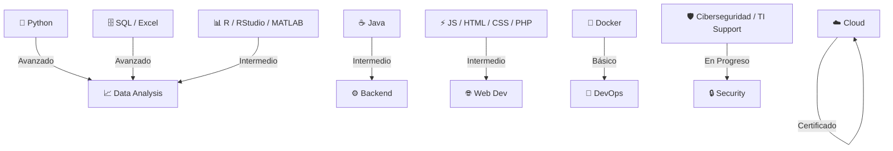

# 🚀 Ignacio Araya Miranda  
**Estudiante Ingeniería Computación | Data & Operations Specialist**  
_Santiago, Chile_

## 💼 Perfil Ejecutivo
**Ingeniero en Computación en formación (UGM, 2023-)** con visión operativa de **Ingeniería Civil Industrial (UFT)**. Experiencia probada en **logística (Zatara Spa)**, **e-commerce/marketing (+50% ventas online, Bazar del Mundo)** y **turismo premium (Fraymontour)**. Certificado **Cisco Networking/IT Essentials**, **Azure Fundamentals**, **Google Marketing Digital**.[file:44]

> **Logro clave**: Incrementé ventas online 50% vía web maintenance y data client analysis. Listo para **Data Analyst / DevOps Junior / Soporte TI Avanzado**.

- 📍 **Santiago, CL** | +56 9 4538 2705 | ignacio.aaraya.m@gmail.com
- 🎯 **Buscando**: Oportunidades en Data, Cloud Security, Operations Tech (Remoto/Híbrido)

## 🛠️ Skills Matrix (Validado GitHub)

### Tabla Skills Detallada
| **Categoría** | **Nivel** | **Tecnologías** |
|--------------|-----------|-----------------|
| **Data & Analytics** | ⭐⭐⭐⭐ | Python, SQL, R/RStudio, MATLAB, Excel Avanzado[file:44] |
| **Development** | ⭐⭐⭐ | Java, JavaScript, PHP, HTML/CSS |
| **Operations** | ⭐⭐⭐⭐⭐ | Logística, Inventarios, E-commerce (WordPress?), Marketing Digital |
| **Cloud & DevOps** | ⭐⭐ | Docker, AWS/Azure (MS Learn), Cisco Networking/IT Essentials |
| **Security / TI** | ⭐⭐⭐ | Soporte Hardware/Software, Ciberseguridad (Estudio) |

## 🌟 Experiencia Destacada (De CV)
- **Zatara Spa (2022-23)**: Encargado Abastecimiento – Control inventario, logística eventos, +cliente directo.[file:44]
- **Bazar del Mundo (2023-24)**: E-commerce/Marketing – +50% ventas online, DB clientes, soporte TI.[file:44]
- **Fraymontour (2024-25)**: Guía Tours Premium – Atención intl., gestión vehículo/contenidos.[file:44]

## 📂 Proyectos Recomendados (Inicia Aquí)
1. **LogiAnalyzer**: Dashboard Python/SQL para inventarios Zatara-style → [Crea Repo]
2. **EcomBoost**: Análisis ventas +50% (R/Excel → Pandas) → [Crea Repo]
3. **CloudTI**: Azure/Docker para soporte básico → [Crea Repo]

## 📫 Let's Connect
<table align="center">
<tr>
<td></td>
<td></td>
<td></td>
</tr>
</table>

**¡Hablemos de oportunidades!** ⭐ Star si impacta. #ChileTech #DataJobs #CyberCareers[file:44]

