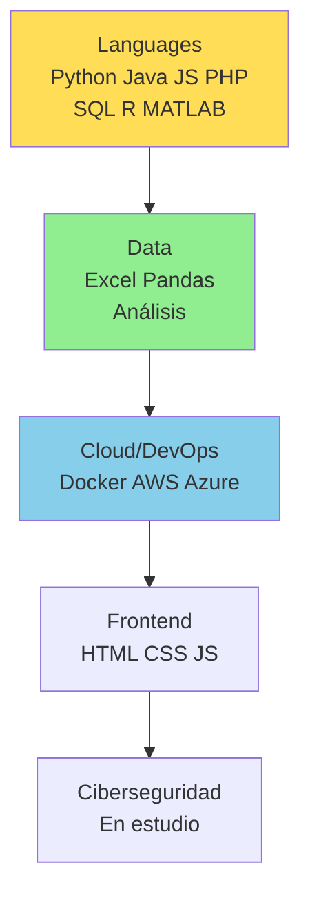

# 👨‍💻 Ignacio Araya | Emprendedor Tech & Data Analyst

  
    
  
  

## 🚀 Sobre Mí
**Emprendedor chileno en Santiago** con sólida base en **análisis de datos, desarrollo y cloud**, transitando de logística, marketing y turismo hacia roles tech full-time. Aplico programación para optimizar negocios reales (ej. automatización logística).

- 🔭 **En transición**: Buscando oportunidades en **Data Analysis, DevOps o Ciberseguridad Junior**.
- 🌱 **Skills clave**: Python (avanzado), Java, JavaScript, SQL, R/RStudio, MATLAB, PHP, Docker; básico AWS/Azure/Cloud.
- 💼 **Experiencia aplicada**: Análisis de datos en Excel/SQL para logística/turismo; ciberseguridad en estudio.
- ⚡ **Meta**: Impactar empresas con data-driven decisions y secure apps.
- 📍 **Ubicación**: Santiago, Chile | Abierto a remoto/híbrido.

## 🛠️ Stack Técnico

| Categoría | Tecnologías |
|-----------|-------------|
| **Lenguajes** | Python, Java, JavaScript, PHP, SQL, R, MATLAB |
| **Data/Tools** | Excel, RStudio, Análisis de Datos |
| **DevOps/Cloud** | Docker, AWS (básico), Azure (básico) |
| **Web** | HTML, CSS |
| **En Progreso** | Ciberseguridad |

## 📈 GitHub Stats

  
  

## 🔥 Proyectos en Desarrollo
- **[OptiLogística]**: Análisis predictivo para supply chain (Python/SQL) – [Enlace](https://github.com/ignacioaraya/optlogistica)
- **[TurismoApp]**: Dashboard web para métricas (PHP/JS/Excel) – [Enlace](https://github.com/ignacioaraya/turismoapp)
- **[DockerSecure]**: Contenedores básicos con foco ciberseguridad – Próximamente
*(Agrega tus repos aquí para mostrar aplicación práctica de skills en ex-trabajos)*

## 📫 Contáctame

  
  
  

¡Star este perfil y conectemos para colaborar! 🚀 **#DataScience #DevOps #Ciberseguridad #ChileTech**

