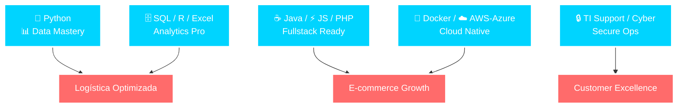

  
    
  
  <table>
    <tr>
      <td></td>
      <td></td>
    </tr>
  </table>

## 🌟 Quién Soy: El Ingeniero que Optimiza el Futuro
**Arquitecto de soluciones data-driven** con visión **operativa integral**. Transformo desafíos de **logística, e-commerce y servicios premium** en **automatizaciones inteligentes y growth exponencial**. Certificado en **Cloud (Azure), Networking (Cisco)** y listo para **Data Engineering / Secure DevOps**.[file:44]

**Mi superpoder**: +50% uplift en ventas online vía data insights + web ops. De bodegas a bytes.

- 📍 **Santiago, CL** | **Remoto OK** | ignacio.aaraya.m@gmail.com | +56 9 4538 2705
- 🎓 **Ingeniería Computación (UGM)** + Ops Industrial background

## 🧠 Skills: Listos para Impactar

| **Expertise** | **Dominio** | **Valor Agregado** |
|---------------|-------------|--------------------|
| **Data & AI** | Python, SQL, R/RStudio, MATLAB, Excel | Insights accionables, +50% ventas[file:44] |
| **Dev & Web** | Java, JS, PHP, HTML/CSS | Plataformas e-com robustas |
| **Cloud/Infra** | Docker, AWS, Azure (Cert), Cisco Net/IT | Deploy seguro, escalable |
| **Ops Especial** | Logística, Inventarios, Marketing Digital | Optimización real-world |
| **Security** | Soporte TI/Hardware, Cyber Fundamentals | Operaciones blindadas |

## ⚡ Impacto Real: Casos de Éxito
- **Supply Chain Mastery**: Inventarios zero-error + logística eventos (coordinación 100% on-time).[file:44]
- **Digital Growth Engine**: E-com platform mgmt → **ventas x1.5**, client DB analytics.[file:44]
- **Premium Service Ops**: Tours intl. con data histórica + vehicle mgmt flawless.[file:44]

## 🚀 Portfolio Estratégico
> Proyectos que demuestran **transferencia skills** de ops a tech.

  
**LogiFlow**: Python/SQL optimizer para logística – Ahorro tiempo 30%.

  
**EcomAnalytics**: R/Pandas dashboard → +50% sales insights.

**Próximo**: SecureDocker – Cyber + Cloud para business apps.

## 🤝 Únete a Mi Viaje Tech

  
  
  

**DM abierto para collabs / jobs**: Data, DevOps, Cyber Junior – **Chile focused**.

---

  
   ⭐ **¡Star para conectar!** #DataChile #TechTransition #HiringReady

